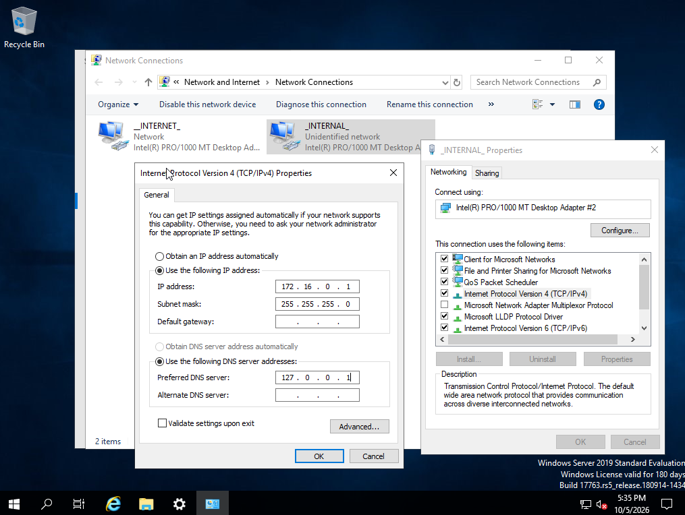
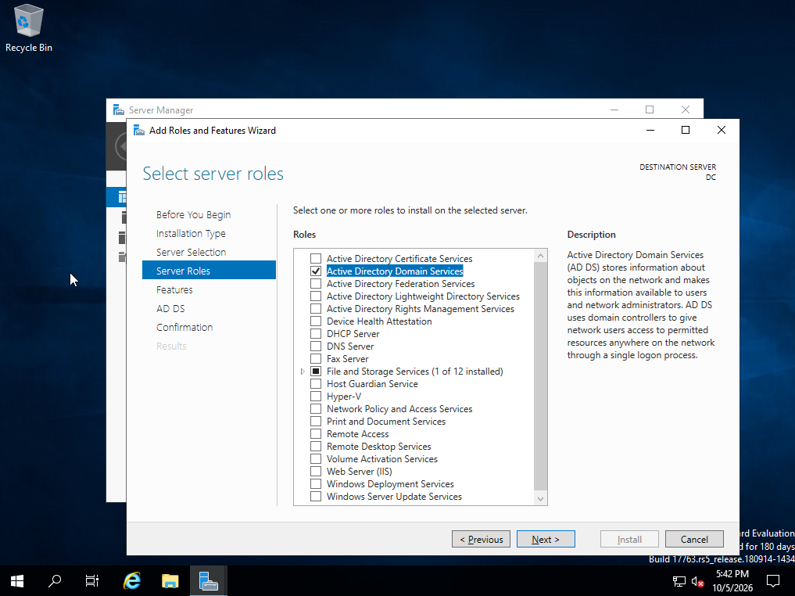
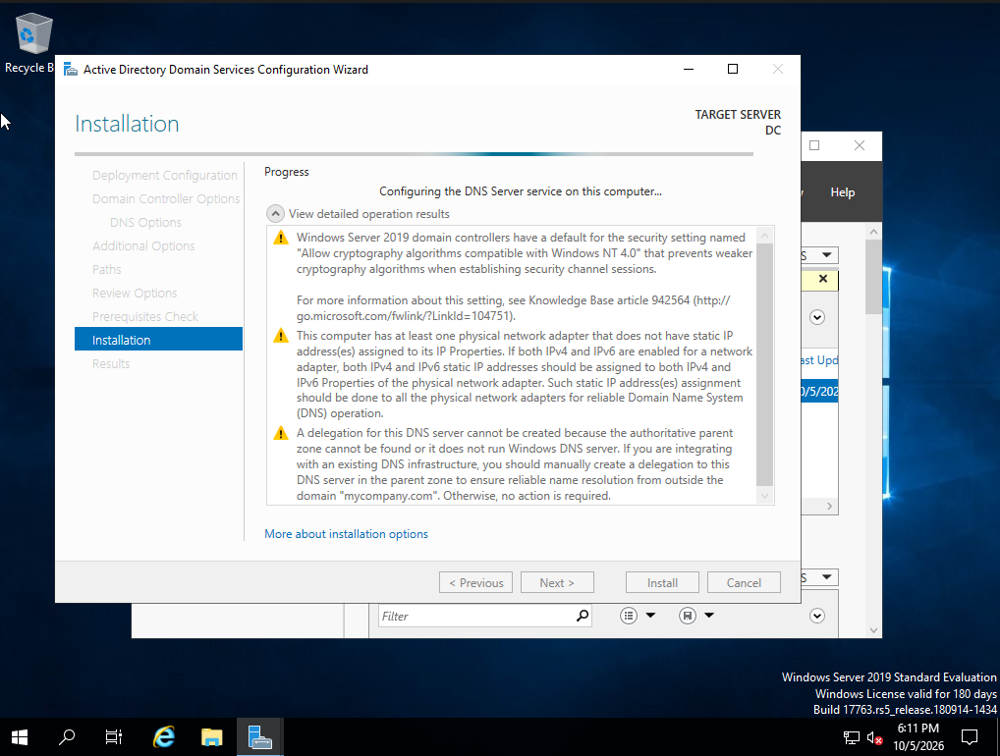
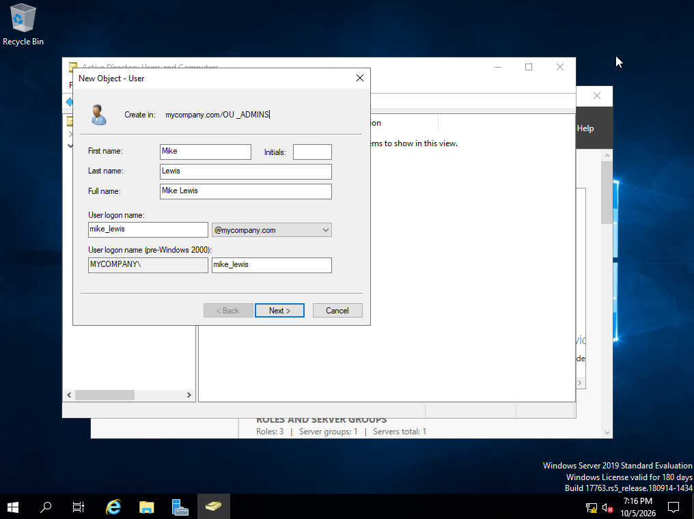
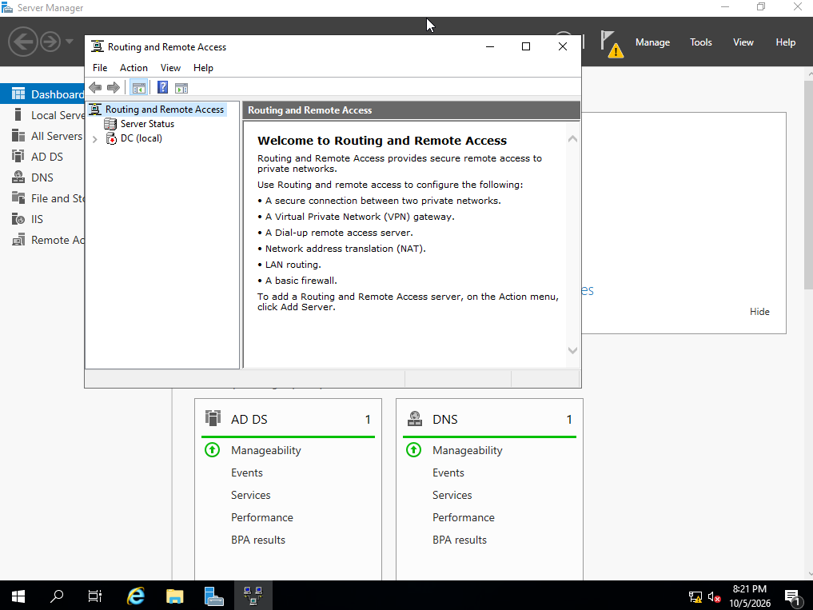
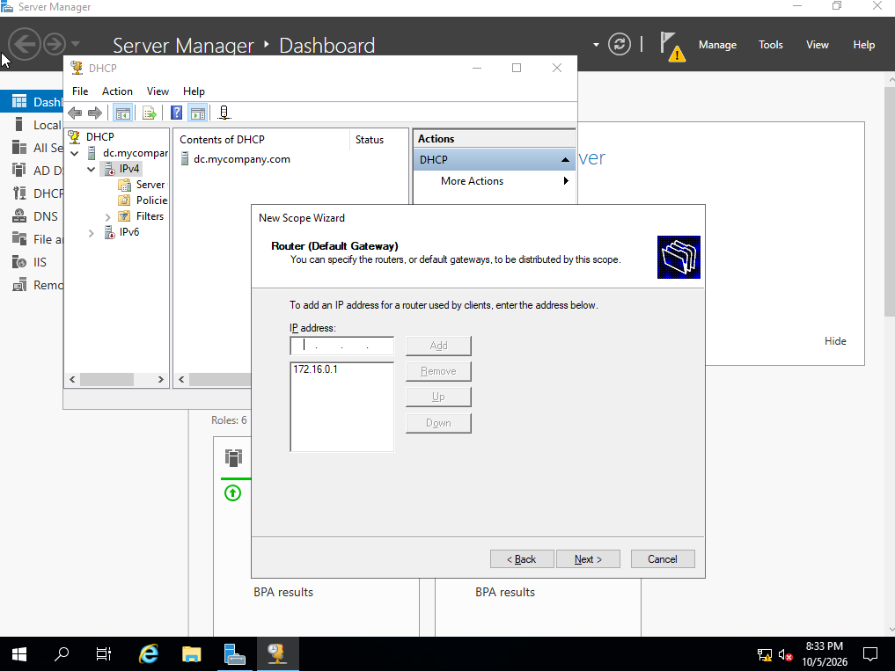
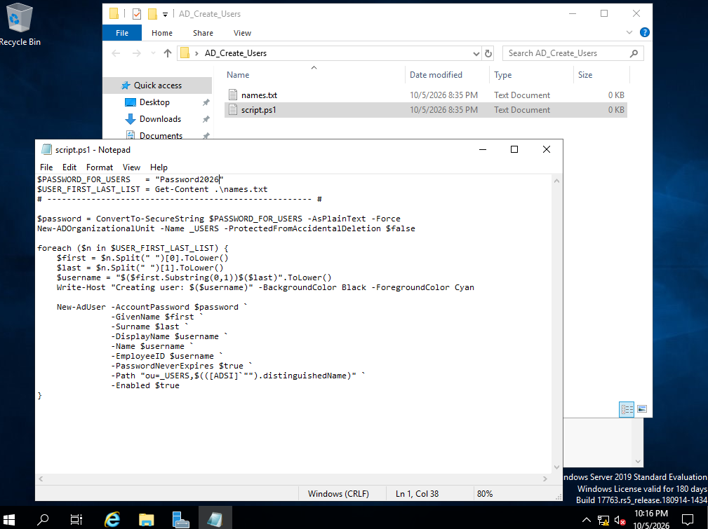
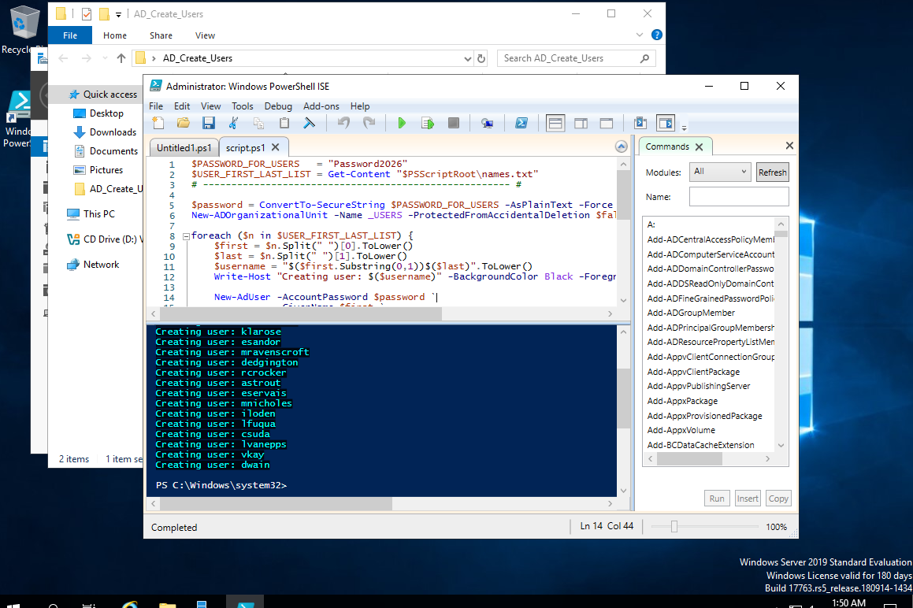
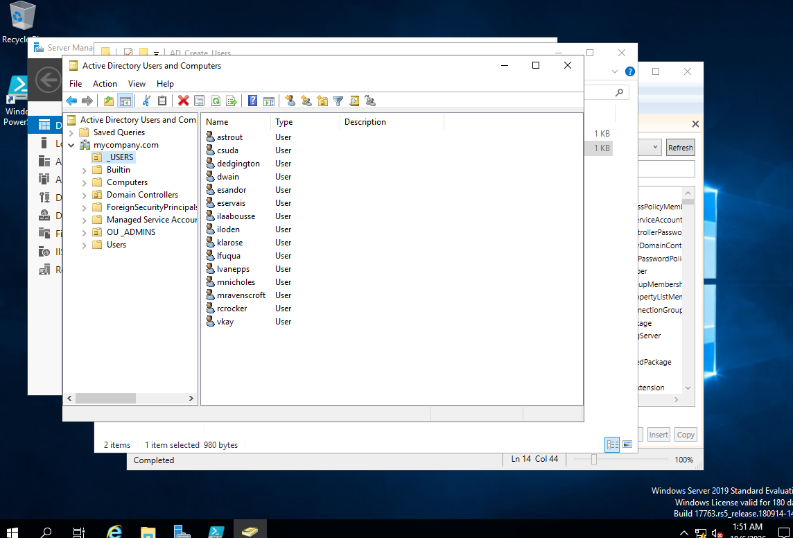

# active-directory-home-lab
Windows Server 2019 Active Directory home lab with AD DS, DNS, DHCP, NAT, PowerShell user automation and a domain-joined Windows 10 client.

# Active Directory Home Lab

## Overview

I built an Active Directory home lab in Oracle VirtualBox to get hands-on experience with Windows Server, Active Directory and basic network and user admin.

The lab uses Windows Server 2019 as a domain controller and Windows 10 Enterprise as a domain client. I configured Active Directory Domain Services, DNS, DHCP and NAT, used PowerShell to automate user account creation, joined a Windows 10 client to the domain, and tested logging in with a domain user account.

This project was completed by following and adapting the Active Directory Home Lab guide by laabousse.

## Lab Environment

- Oracle VirtualBox
- Windows Server 2019
- Windows 10 Enterprise
- Active Directory Domain Services (AD DS)
- DNS
- DHCP
- Remote Access Service (RAS)
- Network Address Translation (NAT)
- PowerShell

## 1. Configuring the Server Network

I configured the internal network interface with a static IP address of `172.16.0.1/24`. This interface is used by the Windows clients on the private lab network.

The domain controller also uses itself as the DNS server because DNS is provided alongside Active Directory.

## 2. Installing Active Directory Domain Services

I installed the Active Directory Domain Services (AD DS) role through Server Manager to prepare the Windows Server to act as the domain controller for the lab.

### Promoting the Server to a Domain Controller

After installing AD DS, I promoted the Windows Server to a domain controller and created the Active Directory domain.

This provides the central domain used to manage and authenticate the users and computers in the lab.

### Creating a Dedicated Domain Administrator

I created a dedicated administrator account in Active Directory instead of continuing to use the built-in Administrator account.

I added the account to the Domain Admins group so it could be used for administrative tasks across the domain.

## 3. Configuring RAS and NAT

I configured Remote Access and Network Address Translation (NAT) on the domain controller.

This allows the Windows 10 client on the private internal network to access the internet through the domain controller instead of connecting directly through VirtualBox NAT.

## 4. Configuring DHCP

I installed and configured DHCP on the domain controller so clients on the internal network can automatically receive their network configuration.

I created and activated a DHCP scope for the lab network and authorized the DHCP server in Active Directory.

## 5. Automating Active Directory User Creation

Instead of manually creating each test user, I used a PowerShell script to automate bulk user creation in Active Directory.

The script reads names from a text file, separates the first and last names, generates a username and creates each account inside the `_USERS` Organizational Unit.

### Running the PowerShell Script

I ran the script through PowerShell ISE on the domain controller and monitored the output as the Active Directory accounts were automatically generated.

### Verifying the Created Users

After running the script, I opened Active Directory Users and Computers and verified that the generated accounts had been successfully created inside the `_USERS` Organizational Unit.

