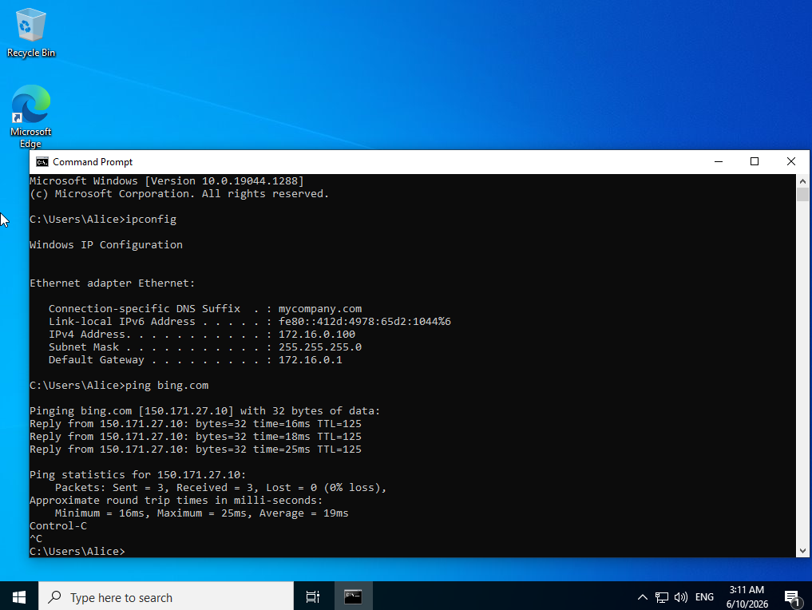
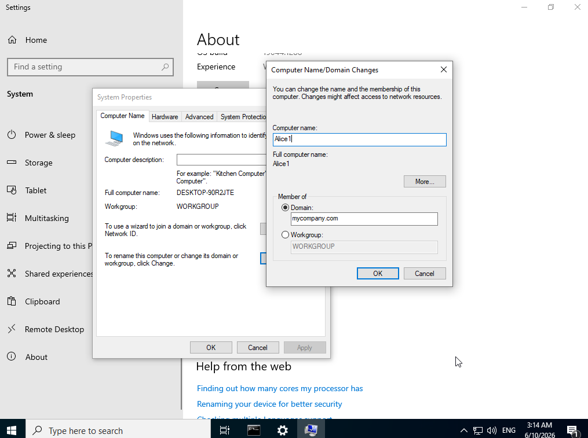
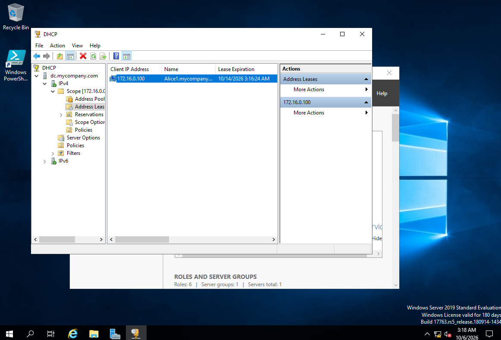
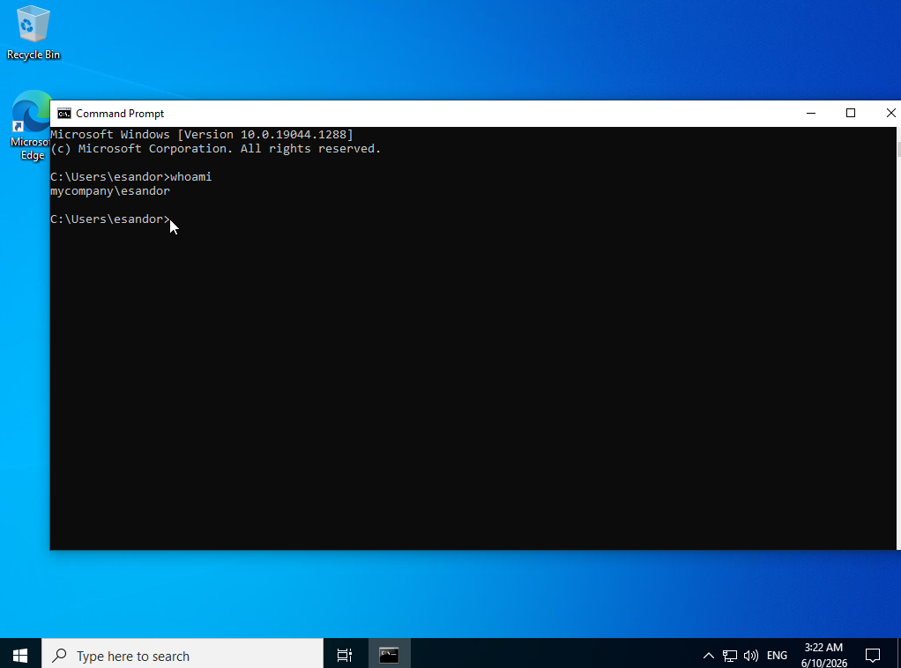

# active-directory-home-lab
Windows Server 2019 Active Directory home lab with AD DS, DNS, DHCP, NAT, PowerShell user automation and a domain-joined Windows 10 client.

## Overview

I built this Active Directory home lab in Oracle VirtualBox to get hands-on experience with Windows Server, Active Directory and basic network administration.

The lab uses Windows Server 2019 as a domain controller and Windows 10 Enterprise as a domain client. I configured Active Directory Domain Services, DNS, DHCP and NAT, used PowerShell to automate user creation, joined a Windows 10 client to the domain, and tested logging in with a domain user account.

This project was completed by following and adapting the Active Directory Home Lab guide by laabousse.
## Lab Environment

- Oracle VirtualBox
- Windows Server 2019
- Windows 10 Enterprise
- Active Directory Domain Services (AD DS)
- DNS
- DHCP
- Remote Access Service (RAS)
- Network Address Translation (NAT)
- PowerShell

## 1. Configuring the Server Network

I configured the internal network interface with a static IP address of `172.16.0.1/24`. This interface is used by the Windows clients on the private lab network.

The domain controller also uses itself as the DNS server because DNS is provided alongside Active Directory.

## 2. Installing Active Directory Domain Services

I installed the Active Directory Domain Services (AD DS) role through Server Manager to prepare the Windows Server to act as the domain controller for the lab.

### Promoting the Server to a Domain Controller

After installing AD DS, I promoted the Windows Server to a domain controller and created the Active Directory domain.

This provides the central domain used to manage and authenticate the users and computers in the lab.

### Creating a Dedicated Domain Administrator

I created a dedicated administrator account in Active Directory instead of continuing to use the built-in Administrator account.

I added the account to the Domain Admins group so it could be used for administrative tasks across the domain.

## 3. Configuring RAS and NAT

I configured Remote Access and Network Address Translation (NAT) on the domain controller.

This allows the Windows 10 client on the private internal network to access the internet through the domain controller instead of connecting directly through VirtualBox NAT.

## 4. Configuring DHCP

I installed and configured DHCP on the domain controller so clients on the internal network can automatically receive their network configuration.

I created and activated a DHCP scope for the lab network and authorized the DHCP server in Active Directory.

## 5. Automating Active Directory User Creation

Instead of manually creating each test user, I used a PowerShell script to automate bulk user creation in Active Directory.

The script reads names from a text file, separates the first and last names, generates a username and creates each account inside the `_USERS` Organizational Unit.

### Running the PowerShell Script

I ran the script through PowerShell ISE on the domain controller and monitored the output as the Active Directory accounts were automatically generated.

### Verifying the Created Users

After running the script, I opened Active Directory Users and Computers and verified that the generated accounts had been successfully created inside the `_USERS` Organizational Unit.

## 6. Configuring the Windows 10 Client

I created a Windows 10 Enterprise virtual machine and connected it to the isolated internal VirtualBox network rather than directly connecting it through VirtualBox NAT.

This means the client relies on the Windows Server for its network configuration and access to the rest of the network.

### Verifying Client Network Configuration

I used `ipconfig` on the Windows 10 client to verify that it had automatically received its network configuration from the DHCP server.

This confirmed that the client was successfully communicating with the domain controller and receiving an IP address from the DHCP scope I configured earlier.

## 7. Joining the Windows 10 Client to the Domain

I joined the Windows 10 client to the Active Directory domain using the dedicated domain administrator account created earlier.

After successfully joining the domain, I restarted the client to complete the process.

### Verifying the DHCP Lease

Back on the domain controller, I checked the DHCP address leases and verified that the Windows 10 client had automatically received an IP address from the DHCP server.

This confirmed that the DHCP configuration created earlier was working correctly with the client machine.

## 8. Testing Domain User Authentication

Finally, I logged into the Windows 10 client using one of the domain user accounts that was created earlier with the PowerShell script.

I ran `whoami` to verify that the Windows session was authenticated using the Active Directory domain account.

## Skills Demonstrated

- Windows Server 2019 administration
- Active Directory Domain Services (AD DS)
- Domain controller configuration
- Active Directory users, groups and Organizational Units
- DNS and DHCP configuration
- Static IPv4 addressing and subnetting
- Remote Access Service (RAS) and Network Address Translation (NAT)
- PowerShell user automation
- Windows domain joining
- Domain user authentication
- VirtualBox virtual networking
- Basic network testing and troubleshooting

## Acknowledgements

This project was completed by following and adapting the [Active Directory Home Lab guide by laabousse](https://github.com/laabousse/Active-Directory-Home-Lab). I documented my own implementation and testing as I worked through the lab.
